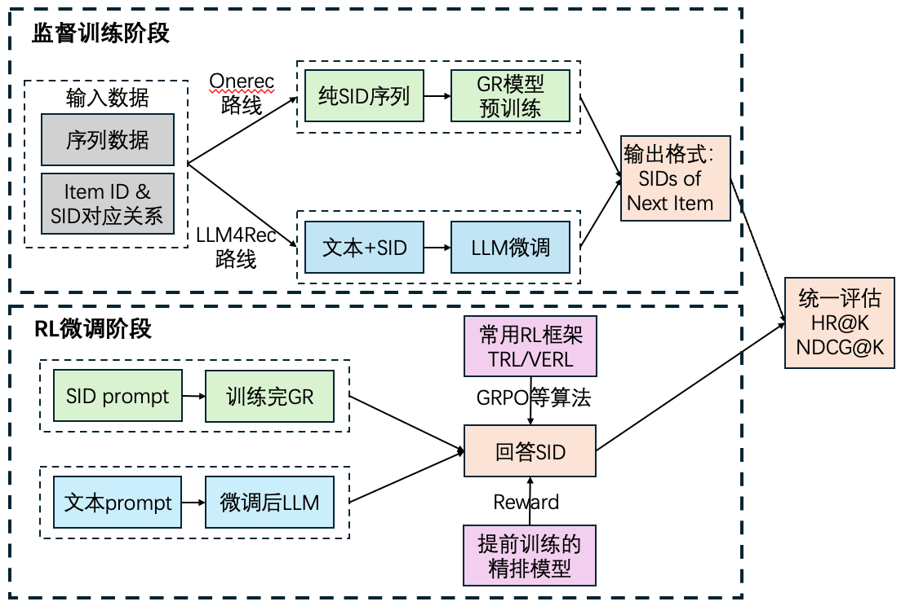

# README
## 1. 整体框架

## 998. 备忘录
1. 现在的eval metric用的是HR和NDCG，这两个都是基于字符串匹配的（也就是说reward要单独写）
2. 文件/文件夹名以“temp_”或者“trash_”开头会被自动忽略，更多自动忽略请参见.gitignore

## 999. TODO
- [ ] Beam Search的时候添加前缀树，增强可控性
- [ ] 给两种模型各写一个RL，基于各自的eval生成函数进行写，观察它们的生成方式来用一个代码运行起来，别忘了使用参数控制vllm
- [ ] 更换更多更新的框架
- [x] 把tokenizer改回来，看看qwen是怎么写tokenizer的，看情况可以去掉空格，对齐Onerec-think的输入格式
- [x] 为train_single添加测试集，便于在训练过程中测试